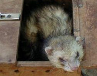

# Project Ferret  

|  |  |
| --- | ---------- |
|  | This is a [Ferret (Frettchen)](https://a-z-animals.com/animals/ferret/) |

## Angular 2 User Input 

This project shows ...

* how to handle user inputs in Angular 2
* how to bind user input events to methods
* how to pass DOM event objects to methods
* how to use [template reference variables](https://angular.io/docs/ts/latest/guide/template-syntax.html#!#ref-vars)
* how to use Angular 2 pseudo events
* how to add some data to a list

These techniques are useful for small-scale demonstrations,
but they quickly become verbose and clumsy when handling large
amounts of user input. Two-way data binding is a more elegant 
and compact way to move values between data entry fields and model properties.
The next tutorial project, [gerbil](gerbil), explains how to write two-way bindings with `NgModel`.

This tutorial uses Netbeans, Gulp.js, Node.js, Express Web-Server.

Open [Angular 2 tutorial User Input](https://angular.io/docs/ts/latest/guide/user-input.html)
to work through step by step.

Follow the links to find some more information for
[Netbeans IDE](http://netbeans.org/), 
[Gulp.js](https://www.npmjs.com/package/gulp),
[Node.js](https://nodejs.org/en/), 
[Express Web-Server](https://www.npmjs.com/package/express), 
[Angular 2](https://angular.io/docs/) and 
[TypeScript](https://www.typescriptlang.org/).

--------------------------------------------------------------

## How to run the project

To do (on Linux OS) ...

1. open shell and clone git repository  
  `git clone <repository-url>`
2. change working directory to project and install node modules  
  `cd <project-dir>/ferret`  
  `npm install`
3. transpile the typescript files and start the server  
  `npm start`
4. start a web-client and test the server  
  [http://localhost:8080](http://localhost:8080)

-------------------------------------------------------------

## System Preparation

See [Angular2 / Dingo / System preparation](https://github.com/ManfredSteiner/angular2/tree/master/dingo#system-preparation)

--------------------------------------------------------------

## Project description

Filenames in brackets are generated by the 'Build' process (via Gulp.js).

```
project   ---- nbproject ---- customs.json
         |               ---- ...
         |                
          ---- public ---- (ng2) ---- (app) ---- (app.component.js)
         |           |          |                (app.component.js.map)
         |           |          |                (app.module.js)
         |           |          |                (app.module.js.map)
         |           |          |                (click-me.component.js)
         |           |          |                (click-me.component.js.map)
         |           |          |                (click-me2.component.js)
         |           |          |                (click-me2.component.js.map)
         |           |          |                (keyup.components.js)
         |           |          |                (keyup.components.js.map)
         |           |          |                (little-tour.component.js)
         |           |          |                (little-tour.component.js.map)
         |           |          |                (loop-back.component.js)
         |           |          |                (loop-back.component.js.map)
         |           |          |                (main.js)
         |           |          |                (main.js.map)
         |           |          |
         |           |           ---- (shared) ---- (hero.js)
         |           |                              (hero.js.map)
         |           |
         |            -- index.html
         |               styles.css
         |               systemjs.config.js
         |
          -- src ---- ng2 ---- app ------ app.component.ts
         |         |     |                app.module.ts
         |         |     |                click-me.component.js
         |         |     |                click-me2.component.js
         |         |     |                keyup.components.js
         |         |     |                little-tour.component.js
         |         |     |                loop-back.component.js
         |         |     |                loop-back.component.js.map
         |         |     |                main.ts
         |         |     |
         |         |      ---- shared --- hero.ts
         |         |
         |          -- server.js
         |             tsconfig.json
         |             Symbolic link to ../README.md
         |             Symbolic link to ../TUTORIAL.md
         |
          -- package.json
             gulpfile.js
             README.md
             TUTORIAL.md
             .gitignore
```

-------------------------------------------------------------

### Dependencies

See [Angular2 / Dingo / Dependencies](https://github.com/ManfredSteiner/angular2/tree/master/dingo#dependencies)

-------------------------------------------------------------


## How to create project from scratch

See [Angular2 / Dingo / Variant B] (https://github.com/ManfredSteiner/angular2/tree/master/dingo#variant-b-create-project-from-scratch)
