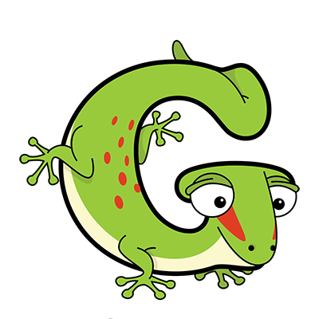

# Project Gecko

|  |  |
| --- | ---------- |
|  | This is a [Gecko](https://a-z-animals.com/animals/gecko/) |
 
## Angular 2 template syntax

This project shows how to use templates in Angluar 2.  
It is directly linked to the tutorial [https://angular.io/docs/ts/latest/guide/template-syntax.html](https://angular.io/docs/ts/latest/guide/template-syntax.html).

This tutorial uses Netbeans, Gulp.js, Node.js, Express Web-Server.

Follow the links to find some more information for
[Netbeans IDE](http://netbeans.org/), 
[Gulp.js](https://www.npmjs.com/package/gulp),
[Node.js](https://nodejs.org/en/), 
[Express Web-Server](https://www.npmjs.com/package/express), 
[Angular 2](https://angular.io/docs/) and 
[TypeScript](https://www.typescriptlang.org/).

--------------------------------------------------------------

## How to run the project

To do (on Linux OS) ...

1. open shell and clone git repository  
  `git clone <repository-url>`
2. change working directory to project and install node modules  
  `cd <project-dir>/gecko`  
  `npm install`
3. transpile the typescript files and start the server  
  `npm start`
4. start a web-client and test the server  
  [http://localhost:8080](http://localhost:8080)

