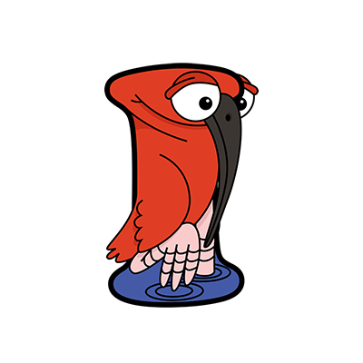

# Project Ibis  

|  |  |
| --- | ---------- |
|  | This is a [Ibis (Rapp)](https://a-z-animals.com/animals/ibis/) |
 
## Angular 2 services and injections
### Part 1 - Basics

This project shows ...

* how to use Angluar 2 services and injections
* how to define CSS styles inside the Angular 2 Component
* how to enable Angular 2 productive mode

Open [Angular 2 tutorial Services](https://angular.io/docs/ts/latest/tutorial/toh-pt4.html)
and work through from beginning to chapter 
[Preparing the HeroListComponent for injection](https://angular.io/docs/ts/latest/guide/dependency-injection.html#preparing-the-herolistcomponent-for-injection).

See file [app.component.ts](src/ng2/app/app.component.ts) to see how to define CSS styles inside
a Component.

See file [main.ts](src/ng2/app/main.ts) to see how to enable productive mode.  
Uncomment the two productive mode statements to enable productive mode.

--------------------------------------------------------------

This tutorial uses Netbeans, Gulp.js, Node.js, Express Web-Server.  
Follow these links to find some more information for
[Netbeans IDE](http://netbeans.org/), 
[Gulp.js](https://www.npmjs.com/package/gulp),
[Node.js](https://nodejs.org/en/), 
[Express Web-Server](https://www.npmjs.com/package/express), 
[Angular 2](https://angular.io/docs/) and 
[TypeScript](https://www.typescriptlang.org/).

--------------------------------------------------------------

## How to run the project 

To do (on Linux OS) ...

1. open shell and clone git repository  
  `git clone <repository-url>`
2. change working directory to project and install node modules  
  `cd <project-dir>/ibis`  
  `npm install`
3. build the project and start the server  
  `npm start`
4. start a web-client and test the server  
  [http://localhost:8080](http://localhost:8080)

-------------------------------------------------------------
